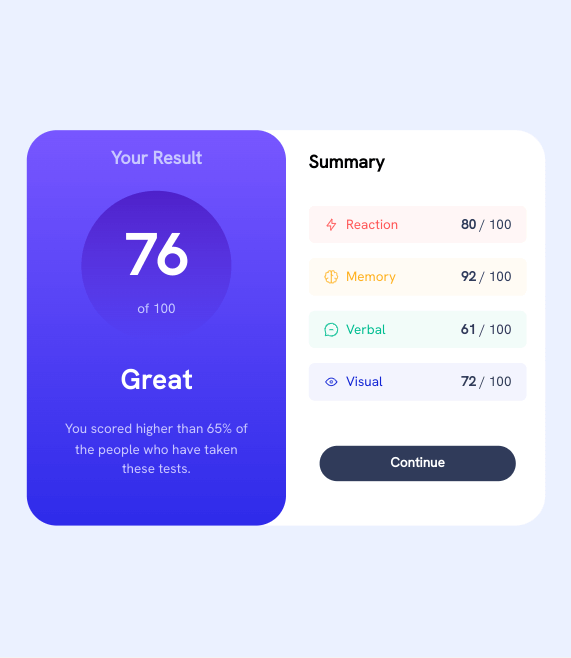
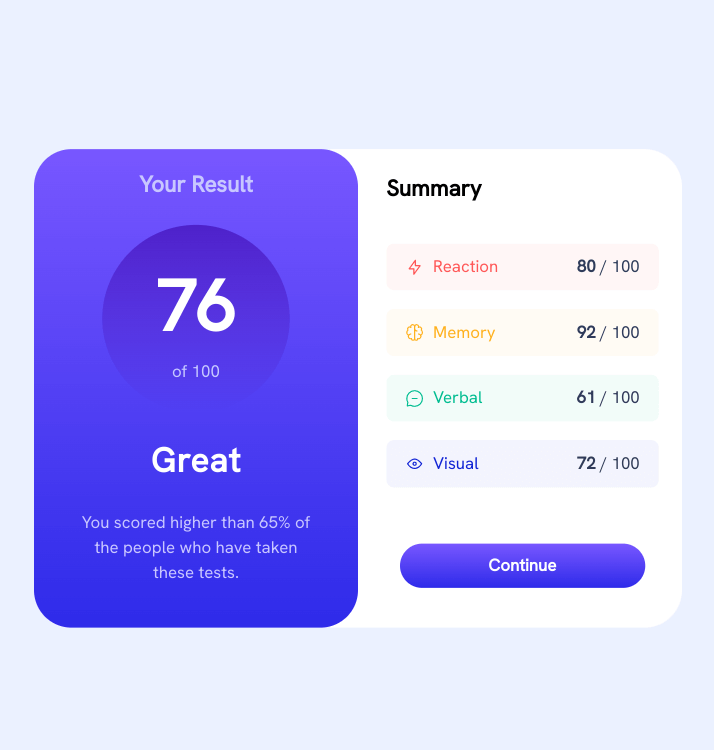
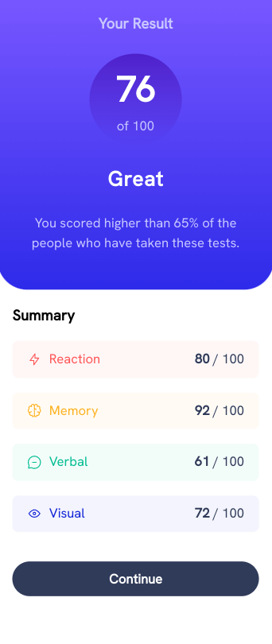

# Frontend Mentor - Results summary component solution

This is a solution to the [Results summary component challenge on Frontend Mentor](https://www.frontendmentor.io/challenges/results-summary-component-CE_K6s0maV).

## Table of contents

- [Overview](#overview)
  - [The challenge](#the-challenge)
  - [Screenshots](#screenshots)
  - [Link](#link)
- [My process](#my-process)
  - [Built with](#built-with)
  - [What I learned](#what-i-learned)
  - [Continued development](#continued-development)
  - [Useful resources](#useful-resources)

## Overview

### The challenge

Users should be able to:

- View the optimal layout for the interface depending on their device's screen size
- See hover and focus states for all interactive elements on the page

### Screenshots

***

***

***

### Link

- Live Site URL: [Github Pages](https://jdegand.github.io/results-summary-component)

## My process

### Built with

- Semantic HTML5 markup
- CSS custom properties
- Flexbox
- CSS Grid
- Mobile-first workflow

### What I learned

Important to remember, height is not inherited and you need to pass `height:100%` to get content to fill the viewport.   

### Continued development

- Use static font styles versus just using variable font

### Useful resources

- [Andy Bell](https://andy-bell.co.uk/a-modern-css-reset/) - CSS reset 
- [CSS Tricks](https://css-tricks.com/the-trick-to-viewport-units-on-mobile/) - viewport units on mobile